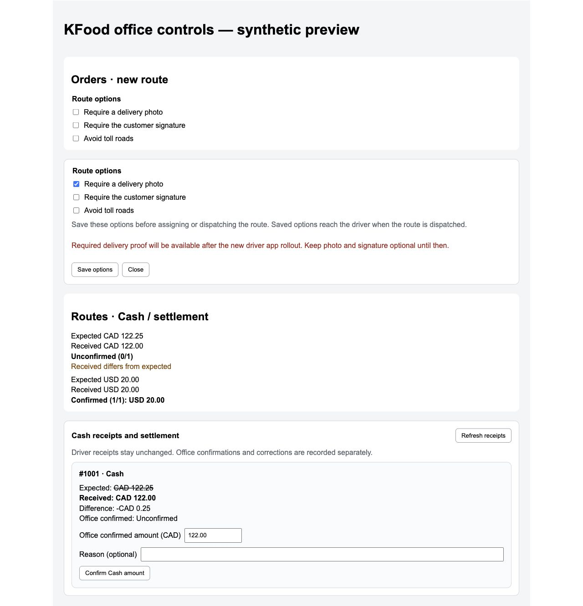
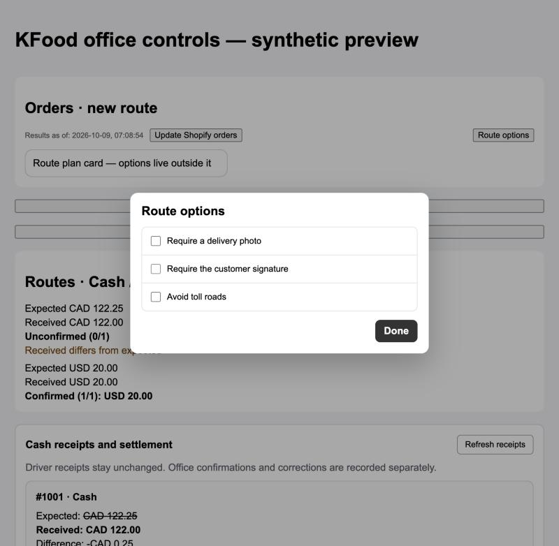
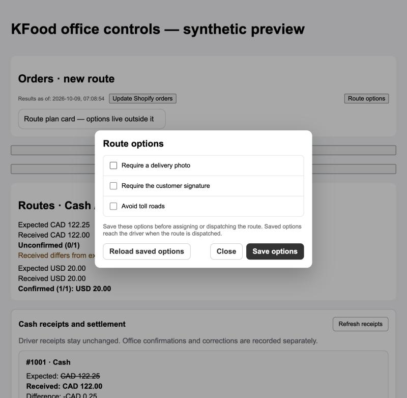
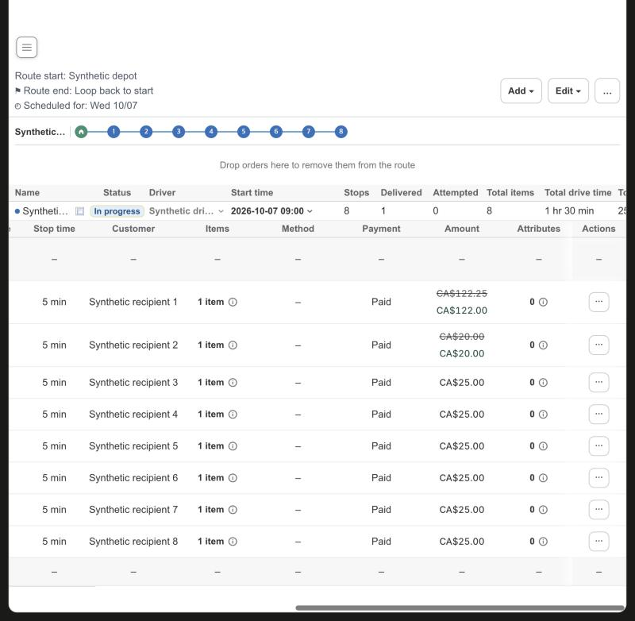

# KFood office Cash amounts and route options

Target issue: EVNSolution/shopify-clever#329.
Change control: EVNSolution/clever-change-control#317.
Server contract: EVNSolution/clever-route-server#490, `docs/api/kfood-delivery-options-settlement.md`.

The KFood app and authenticated KFood store expose these controls. Public and dev Shopify apps keep their existing screens and route creation payloads.

- Orders keeps optional photo, customer signature and avoid-toll-road controls in a **Route options** popup. The button sits in the top row beside **Update Shopify orders**, outside the Route plan card. **Done**, Escape or a click outside closes the popup without resetting chosen values. The settings are part of the same `initialRoute` request and retry identity.
- Route Detail adds **Edit → Route options**, which opens the same popup. Changes retain the `updatedAt` revision from the start of editing and are available only before assignment or Dispatch. Another office edit causes a conflict; **Reload saved options** explicitly replaces the draft and revision. Saving options does not dispatch the route. The server rejects unsupported toll policies or proof activation before the compatible driver rollout.
- Routes adds a **Cash** column with the expected and the driver's received amounts. Currencies never combine. A difference label shows when the received amount differs from the expected amount.
- Route Detail adds an **Amount** column after **Payment**, presented like **ETA**: the order amount alone, then, once the driver recorded Cash for the stop, the expected amount struck through with the amount the driver received below it in green. Stops without a Cash receipt show the order amount only. The column is read-only. Route Detail has no Cash panel, no Cash receipt popup and no office confirmation, and no Refresh button: receipts load with the page and reload when the route updates or another stop completes.
- There is no office confirmation in this app. The confirmation form was removed from Route Detail on 2026-10-09 because it was never requested. Its server action in this app, the confirmation request builder and the confirmed/unconfirmed text of the Routes column were removed with it. The route's Cash receipts are still read, because the **Amount** column needs them.
- Original Shopify orders/customers and driver receipt values do not change. A difference has no inferred tip, discount or debt-waiver meaning.

## Boundaries

Photo and signature requirements default OFF. The server rollout guard remains authoritative. Its `DELIVERY_PROOF_ROLLOUT_DISABLED` and `DELIVERY_PROOF_DRIVER_UPDATE_REQUIRED` codes show driver rollout/update instructions instead of an unexplained save error. Assigning or dispatching the route locks these policies. Existing future-stop edit/Save/Dispatch behavior from PR #328 remains separate.

Both screens show the options in one popup, `OfficeDialog`. The options are a list in `route-office-components.jsx`; a new option is one more list entry plus its server field. The popup is a modal dialog: focus moves into it, Tab stays inside it, Escape or a click outside closes it, and focus returns to the opener. Route Detail discards an unsaved draft when its popup closes. This presentation change does not alter authorization or server policy checks. It replaces the inline disclosure and inline panel from EVNSolution/shopify-clever#332; EVNSolution/clever-change-control#319.

This app never sends an office confirmation, even though the server can record one. This UI does not add refunds, ledger exports, bulk payment adjustments or general accounting.

## Verification

Local checks cover amount normalization, exact route identity, app/store scope, initial-route option propagation and authenticated-store cache refresh after a route options save. Existing navigation, route menus, creation and 13-column KFood list contracts were updated for the new controls.

The real React components run against synthetic transport through:

```sh
cd apps/shopify-app
node scripts/kfood-office-browser-fixture.mjs
```

Browser checks on 2026-10-09 confirmed all options initially off, photo/toll saving and separate CAD/USD Cash summaries. The same checks once covered the office confirmation form, which has since been removed.

Additional browser checks confirmed the proof rollout-disabled message and concurrent office editing: a stale save kept the local draft, explicit reload showed the other office edit, and the next save succeeded.



The screenshot above shows the earlier inline Route options presentation. The popup presentation was checked with the same fixture on 2026-10-09: all options off in the Orders popup, save in the Route Detail popup, a stale-revision conflict that kept the local draft, explicit reload, Escape and outside-click close with focus returning to the opener, Tab staying inside the popup, and a 375 px viewport.





The standalone Cash panel and the receipt popup with the office confirmation form were removed on 2026-10-09 and replaced by the **Amount** column. The real Route Detail page, run with synthetic transport, showed a stop with Cash where the expected CA$122.25 is struck through above the received CA$122.00 in green, a stop where the amounts are equal, and stops without Cash showing CA$25.00 alone. The Start and End rows show a dash, the **Payment** column is plain again, the row menu has no Cash item, and nothing in the column can be clicked.



The Routes **Cash** summary was checked with the same fixture: per currency it shows Expected and Received, and the amber difference label when they differ, with no confirmation text.

This fixture verifies UI behavior and layout. It does not prove a live Shopify session, a production Cash write, or server enforcement. Production rollout must follow the matching server API deployment and the compatible driver release. No real operational receipt was created during UI verification.
