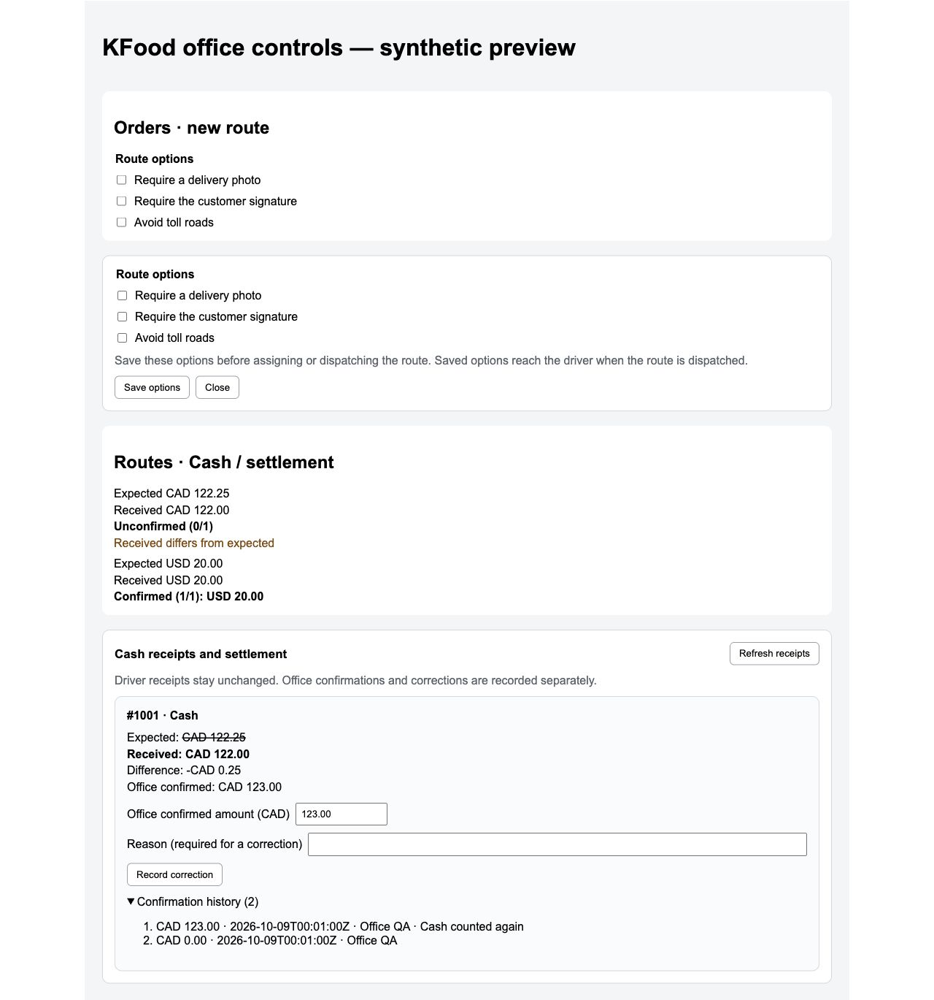

# KFood office Cash and route options

Target issue: EVNSolution/shopify-clever#329.
Change control: EVNSolution/clever-change-control#317.
Server contract: EVNSolution/clever-route-server#490, `docs/api/kfood-delivery-options-settlement.md`.

The KFood app and authenticated KFood store expose these controls. Public and dev Shopify apps keep their existing screens and route creation payloads.

- Orders keeps optional photo, customer signature and avoid-toll-road controls behind a **Route options** button. They start collapsed; the same button opens or closes them without resetting chosen values. The settings are part of the same `initialRoute` request and retry identity.
- Route Detail adds **Edit → Route options**. Changes retain the `updatedAt` revision from the start of editing and are available only before assignment or Dispatch. Another office edit causes a conflict; **Reload saved options** explicitly replaces the draft and revision. Saving options does not dispatch the route. The server rejects unsupported toll policies or proof activation before the compatible driver rollout.
- Routes adds a Cash/settlement column. Expected, driver received, and office confirmed amounts stay separate. Currencies never combine. Partial confirmations show confirmed receipt counts. Difference labels distinguish received-versus-expected and confirmed-versus-received amounts.
- Route Detail shows the immutable driver receipt. A different received amount strikes through the original expected amount. The office can confirm an amount or append a correction with a reason. Zero is valid. Negative values, excess decimal places, missing currency and missing revision cannot submit.
- Every confirmation retains its command ID for an unchanged retry. A stale revision requires refreshing receipts. The authenticated store's route cache is invalidated after a successful change; another store's cache stays intact.
- Original Shopify orders/customers and driver receipt values do not change. A difference has no inferred tip, discount or debt-waiver meaning.

## Boundaries

Photo and signature requirements default OFF. The server rollout guard remains authoritative. Its `DELIVERY_PROOF_ROLLOUT_DISABLED` and `DELIVERY_PROOF_DRIVER_UPDATE_REQUIRED` codes show driver rollout/update instructions instead of an unexplained save error. Assigning or dispatching the route locks these policies. Existing future-stop edit/Save/Dispatch behavior from PR #328 remains separate.

Route Detail starts with the editor closed. **Edit → Route options** opens it directly, without a second disclosure button. Selecting the same menu item again or **Close** closes it. Keyboard access and expanded-state announcements use native buttons. This presentation change does not alter authorization or server policy checks. Follow-up: EVNSolution/shopify-clever#332; EVNSolution/clever-change-control#319.

The current server records office confirmation per Cash receipt. This UI does not add refunds, ledger exports, bulk payment adjustments or general accounting.

## Verification

Local checks cover amount normalization, revision requirements, exact route identity, app/store scope, initial-route option propagation and authenticated-store cache refresh. Existing navigation, route menus, creation and 13-column KFood list contracts were updated for the new controls.

The real React components run against synthetic transport through:

```sh
cd apps/shopify-app
node scripts/kfood-office-browser-fixture.mjs
```

Browser checks on 2026-10-09 confirmed all options initially off, photo/toll saving, separate CAD/USD summaries, expected CAD 122.25 strikethrough against received CAD 122.00, office confirmation at CAD 0.00, rejection of a negative value, and a reasoned correction to CAD 123.00 preserving both audit entries and the original received value.



Additional browser checks confirmed the proof rollout-disabled message and concurrent office editing: a stale save kept the local draft, explicit reload showed the other office edit, and the next save succeeded.


This fixture verifies UI behavior and layout. It does not prove a live Shopify session, a production Cash write, or server enforcement. Production rollout must follow the matching server API deployment and the compatible driver release. No real operational receipt was created during UI verification.
