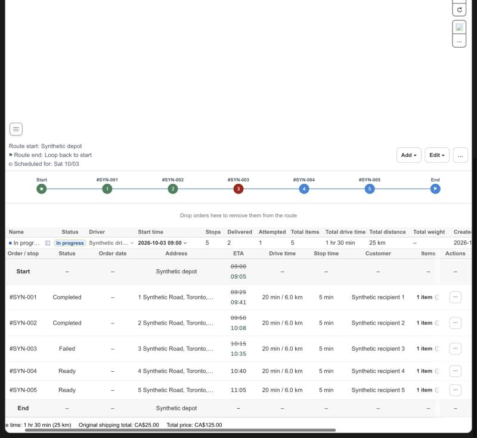

# KFood Route Detail: completion time as the actual time of stops without an arrival

Date: 2026-10-10. Scope: Route Detail in `apps/shopify-app`. Needs the tracking snapshot field `stopCompletions` from clever-route-server (EVNSolution/clever-route-server#495). No driver app, Shopify data or production data change.

## What was wrong

The KFood single Complete Delivery flow records one completion event per stop and no arrival event. Route Detail read actual stop times only from arrival events, so every delivered stop of a live route showed a struck estimate over an empty actual time. The server stored the completion times (it uses them for the rolling ETA) but returned them in no admin response.

## Change

- The tracking snapshot keeps `stopCompletions`, merges it across snapshots, applies the service-day window to it and adds a completion from a live `STOP_DELIVERED` or `STOP_FAILED` progress event.
- A delivered or failed stop shows its arrival when there is one, otherwise its completion time, in the same green slot under the struck estimate. The tooltip and accessible label name it: Actual arrival, Delivered or Failed. An arrival wins over a completion. A completion counts only while the stop status matches its type.
- A visited stop with neither shows the struck estimate and an empty actual, with the tooltip "No arrival or completion time was recorded".
- The End row starts the GPS-observed return search after the last stop's completion when no stop has an arrival. A route that ends at its last stop shows that completion as `Last stop completed`.
- A server that sends no completions behaves exactly as before.

## Verification

Unit tests cover the snapshot normalization, the reconnect merge, the live event, the service-day window, the row presentation (arrival, delivered, failed, mismatched, stale, missing, old server), the route-plan scoping, both End row modes and the page wiring. The real Route Detail page ran against synthetic transport (`scripts/route-status-browser-fixture.mjs`, route "In progress, one-tap completion (no arrivals)"):

- Stop 1 and 2: planned 09:25 and 09:50 struck, actual `Delivered: 09:41` and `Delivered: 10:08`.
- Failed stop 3: planned 10:15 struck, actual `Failed: 10:35`.
- Pending stops 4 and 5: planned estimate only.
- A route with arrivals still shows `Actual arrival` and `Return observed (GPS)`; its stop without any time shows the new empty wording; a route whose snapshot has no `stopCompletions` is unchanged.

