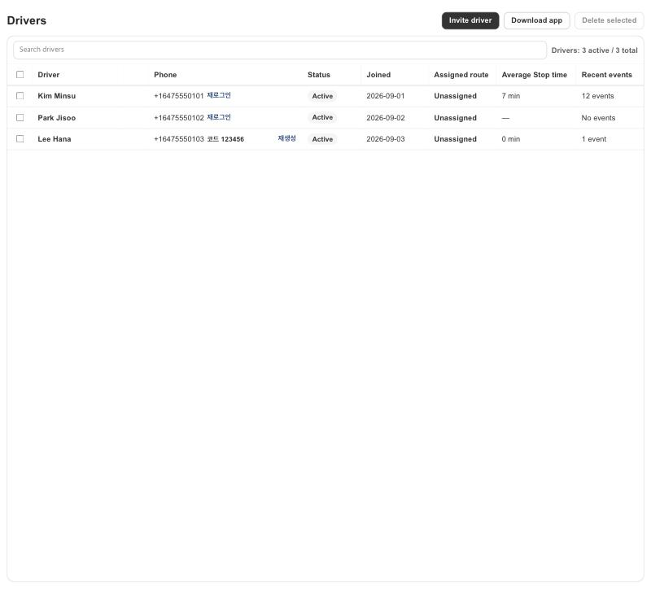
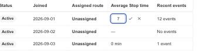

# KFood Drivers: average Stop time per driver

Date: 2026-10-10. Scope: the Drivers table in `apps/shopify-app`, with the server field of clever-route-server#499 / PR #502 (a schema change). No Shopify order data, no driver app change.

## Change

- The Drivers table has an `Average Stop time` column after `Assigned route`. It shows `N min`, or `—` when the driver has none (the server then uses its default of 5 minutes for stops nobody chose).
- The cell is the Stop time cell of Route Detail: a pencil that shows while the pointer is over the cell (or has keyboard focus) opens an inline editor for whole minutes from 0 to 1440. Enter or the check saves, Escape or the cross cancels. An empty field removes the average; any other value that is not whole minutes from 0 to 1440 cannot be saved.
- The editor closes only after the server accepted the value. A failed save keeps what was typed and shows the error above the table.
- The save sends one request, `PATCH /admin/drivers/:id` with only `averageServiceMinutes` (a number, or null to remove it), through the existing driver update fetcher. The name editor is unchanged.
- `StopTimeCell` got two optional props, `subject` (the wording of its accessible names, `average stop time` here) and `allowEmpty`; its default wording on Route Detail is unchanged.
- What the average does is a server rule: the stops of a Ready route that nobody chose take the route driver's average and the planned ETAs follow. A time typed on a stop, or given in Orders Route options, is never replaced.

## Verification

Unit tests: the delivery API call (one field, `null`, `0`; `undefined`, -1, 1441, 2.5 and a string never reach the API), the Drivers action and page wiring, and the cell (subject wording, empty value, Route Detail wording unchanged).

Local preview of the real Drivers page component with a synthetic loader and action (no network): the column shows `7 min`, `—` and `0 min`; the pencil shows on hover; a save sends `averageServiceMinutes` "9" and the cell shows `9 min`; an empty value removes the average; a failed save keeps the editor open and shows the message, and the next save closes it. The preview also found, and the page now avoids, a second save closing the editor at once because the fetcher still held the answer of the first save.

Not covered locally: a save against the real server. This change must be deployed after the server schema change of clever-route-server#502 (without it `PATCH /admin/drivers/:id` rejects `averageServiceMinutes`).
