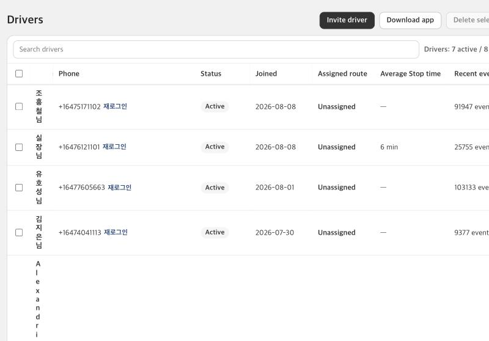
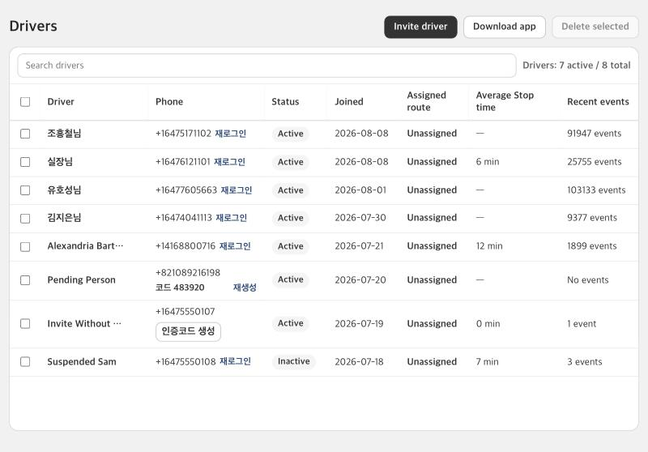
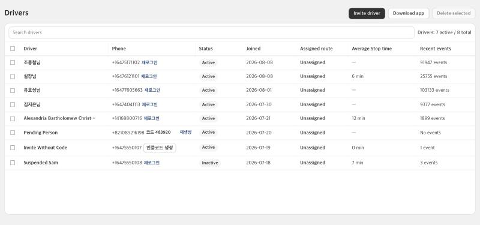
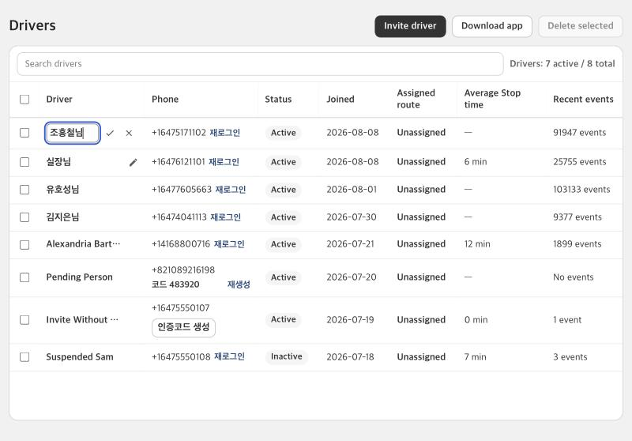
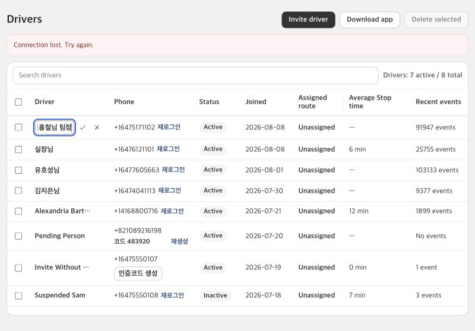

# KFood Drivers: name edited in place, and a name column that stays readable

Date: 2026-10-10. Scope: the Drivers table in `apps/shopify-app`. No server change, no Shopify order data, no driver app change.

## Problem

In an embedded frame of about 870 px the Drivers table was wider than its frame: the fixed columns added up to 886 px, so the percentage column of the driver name was squeezed to nothing. Korean names were drawn one character per line next to the always-visible pencil column, and the `Driver` header had no width at all (measured: 0 px). The name was also edited through a dialog, unlike the Stop time.

## Change

- The name is edited like the Average Stop time: a pencil that shows while the pointer is over the cell (or has keyboard focus, and always on a touch screen) opens an inline text field with a check and a cross. Enter or the check saves, Escape or the cross cancels. The field takes at most 80 characters and an empty name cannot be saved; the name is trimmed on save.
- The editor closes only after the server accepted the name. A failed save keeps what was typed and shows the error above the table. After a close, keyboard focus goes back to the pencil of that driver, unless focus has already moved to another field.
- Enter or Escape while a Korean or Japanese input method composes a syllable is left to the input method, so confirming a syllable does not save half a name.
- The pencil column and the dialog are removed; the table has 8 columns. The save still posts `_intent=updateDriverName` with `driverId` and `displayName` through the existing update fetcher. The Drivers action and its validation (1 to 80 characters) are unchanged.
- New `InlineTextCell` (`app/features/delivery/inline-text-cell.jsx`) next to `StopTimeCell`. It uses the same CSS classes (`stop-time-cell*`, `td.stop-time-td`) and three small modifier classes in `global.css`. `StopTimeCell` only got an `export` for its icon; its behavior and wording are unchanged.
- Layout: the Driver column has no width of its own and takes what the percentage columns leave (the other columns are 18.5 / 10 / 11.5 / 11 / 14.5 / 12.5 % and the checkbox is 40 px), so a narrow frame cannot squeeze it. A name is one line with an ellipsis and the full name as its `title`. The table surface has a `minWidth` of 800 px, the width at which every column still reads (an 860 px frame leaves a 834 px table, so it does not scroll there). The phone cell lets the invite actions wrap in the shorter column instead of cutting them off.

## Verification

Unit tests (`tests/inline-text-cell.test.mjs`, `tests/drivers-page-actions.test.mjs`): the cell markup and handlers (title, pencil, required text field of at most 80 characters, Enter and check save, Escape and cross cancel, blank and over-long names, busy state, input-method keys, focus return), the page wiring (the pencil column and the dialog are gone, one field is sent through the existing fetcher, the editor closes only on a different error-free answer), and the layout (8 columns, fixed pixel columns far below 700 px, the Driver column at least 100 px at the narrowest table, a minimum width that does not scroll an 860 px frame, one line with an ellipsis).

Local preview of the real Drivers page component with a synthetic loader and action (no network), Korean names `조흥철님`, `실장님`, `유호성님`, `김지은님`, one 70-character English name, two invite-pending drivers:

| Viewport | Table | Driver / Phone / Status / Joined / Route / Average / Recent (px) | Result |
| --- | --- | --- | --- |
| 1500 | 1438 | 276 / 266 / 144 / 165 / 158 / 209 / 180 | every name on one line, 0 cells overflowing, no page scroll |
| 1280 | 1254 | 236 / 232 / 125 / 144 / 138 / 182 / 157 | same |
| 1000 | 974 | 174 / 180 / 97 / 112 / 107 / 141 / 122 | same, the 2 invite-pending phone cells wrap |
| 860 | 834 | 144 / 154 / 83 / 96 / 92 / 121 / 104 | every name on one line, 70-character name cut with an ellipsis, 0 cells overflowing, no page scroll |
| 826 | 800 | 136 / 148 / 80 / 92 / 88 / 116 / 100 | at the minimum; no page scroll (826 = 800 + page padding); one long phone number wraps its link |
| 800 | 800 | same | the page scrolls sideways by 14 px; names still one line |

At 860 and 1280 the Driver header is visible, the long name shows `...` with the full name as title, and the table keeps its sticky header (`position: sticky` with no scrolling ancestor).

Interactions, checked in the preview:

- The pencil shows only on the hovered row, at the right margin of the name cell; Tab from the row checkbox reaches it and shows it with a focus ring (`:focus-visible`, opacity 1).
- Click the pencil: the field opens with the name, focused. Typing `  조흥철 기사님  ` (two spaces before and after) after the existing name and pressing Enter sends one request with `displayName` `조흥철님  조흥철 기사님` (the trailing spaces are trimmed), the cell shows the new name and its `title`, the editor closes and keyboard focus is on the pencil of that driver.
- Escape: no request, the old name stays, focus is on the pencil.
- Empty value: the field turns red (`aria-invalid`), the check is disabled and Enter sends nothing.
- While a save runs the field is read-only and the check is disabled.
- A failed save keeps the editor open with the typed name and shows `Connection lost. Try again.` above the table; the next save closes the editor and the message goes away.
- Opening the pencil of another driver while one save is still running keeps that second editor open and focused when the first answer arrives.

## Not covered

- A save against the real server and the real Shopify admin frame. The save path to the server (`updateDeliveryDriverName`) is unchanged.
- Typing with a real input method in a browser; the input-method keys are covered by unit tests only.
- Fonts other than the macOS one (`Apple SD Gothic Neo`); the column minimums were measured with it.
- The editor field is narrow in an 860 px frame (about 65 to 75 px), so a long name scrolls inside the field while it is edited. Korean names of up to 5 or 6 syllables fit.
- A frame narrower than 826 px scrolls the page sideways instead of squeezing the columns.
- The open editor makes its row about 6 px taller (37 px to 43 px), the same as the Average Stop time editor.
