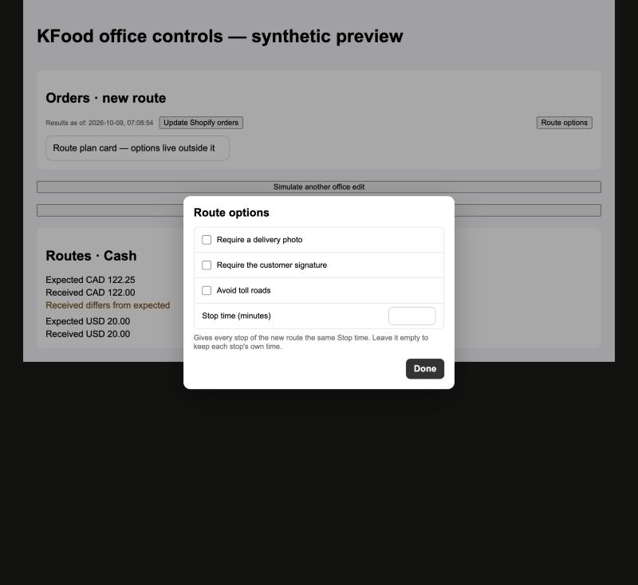
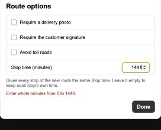

# KFood Orders: one Stop time for every stop of a new route

Date: 2026-10-10. Scope: the Route options popup of Orders in `apps/shopify-app`, with the server field of clever-route-server#497 / PR #498. No Shopify order data, driver app or ETA calculation change.

## Change

- The Route options popup of Orders (KFood only) has a fourth row, `Stop time (minutes)`: a number field for whole minutes from 0 to 1440. A note under the list says: "Gives every stop of the new route the same Stop time. Leave it empty to keep each stop's own time."
- Empty (the default) sends nothing, so each stop keeps its own time. A value is sent as `serviceMinutes` of the form, then as `initialRoute.serviceMinutes` of the route group request, so the server gives every stop of the new route that time in the transaction that creates the route.
- A value outside the range, or not a whole number, shows `Enter whole minutes from 0 to 1440.` under the list and stops `Create route` with a message before any request. The Orders action checks the same limits again.
- Changing the value starts a new route request (the creation key contains all options), like the other options.
- The Route options editor of an existing route does not show the field. Stop times of an existing route are edited per stop in Route Detail (the hover pencil).

## Verification

Unit tests: the parser (`readInitialStopTime`: empty, 0, 7, 1440, spaces; -1, 1441, 7.5, letters, exponent and non-ASCII digits are rejected, and the options form of an existing route never carries a Stop time), the popup (the field only when asked, only its own value changes, the error only for invalid text), the Orders action (the payload carries `serviceMinutes: 7`; an empty field sends none; malformed values stop before any request) and the Orders page (the field is passed, validation runs before the request starts, the value is sent only for KFood).

Local preview of the real popup component (`scripts/kfood-office-browser-fixture.mjs`): the Orders popup shows the new row, 1441 shows the message, 7 clears it, and the Route options editor of an existing route still has only the three options.

Not covered locally: creating a route on real K-food data. After the deployment the check on K-food is view only (the popup and its field); the owner confirms with one real route.
