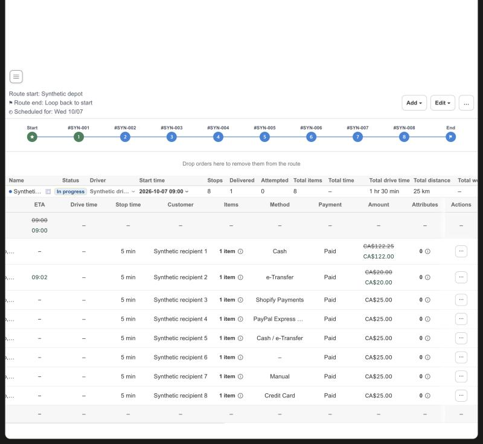

# KFood Route Detail: the Method column shows how each stop pays

Date: 2026-10-10. Scope: the stop table of Route Detail in `apps/shopify-app`. No server, driver app, Amount or ETA change.

## Change

- The stop table of a route and of a route group has one `Method` column, between `Items` and `Payment` (the payment status). It shows how the stop pays. The former `Method` column (the delivery service type, for example EVENING_DELIVERY) was removed at the owner's request on 2026-10-10 ("Method를 지우고, Payment method -> Method로 하자"); the delivery type stays in the row data and in the map popup of a stop.
- Value: the payment gateway names of the order, formatted like the Inventory page (`formatInventoryPaymentMethod`): `Cash` (Cash, COD and similar names), `e-Transfer` (e-Transfer, Interac and similar), `Shopify Payments`, `Manual`, any other gateway name as it is (`PayPal Express Checkout`, `Credit Card`), several joined with ` / `, and `–` when the order carries none. A long name is cut with an ellipsis and its full text is the cell title.
- Data: the order snapshot that Route Detail already loads for its stops. The existing order enrichment copies `paymentGatewayNames` to the stop, `buildRouteStops` keeps it, and the row builder formats it. No server call is added.
- The Start and End rows of the table have the matching empty cells (15 columns plus the Select cell), so the columns stay aligned.

## Verification

Unit tests: the enrichment (`shopifyOrderSnapshot`, top level and `rawPayload` sources; the delivery method is not replaced), the row builder (Cash, e-Transfer, card gateway, several gateways, a legacy payment title, nothing), the column list and order, the cell order and the endpoint row cell count. The full suite (1,182 tests; the column list and cell order tests were updated for the single Method column), typecheck, production build, public URL guard and ESLint on the changed files pass. `app/features/delivery/orders.server.test.js` and `app/features/orders/shopify-orders.server.test.js` fail on a clean `main` as well and are not part of `npm test`.

Local preview of the real Route Detail page (`scripts/live-route-change-browser-fixture.mjs`, stop gateways added for the check only): the header order is `Items`, `Method`, `Payment`, `Amount`, there is no `Payment method` header and no delivery type text, every row has 16 cells for 16 columns; the values are Cash, e-Transfer, Shopify Payments, PayPal Express …, Cash / e-Transfer, – (none), Manual and Credit Card; the Start and End rows show `–`.

After the deployment the check on K-food is view only.
