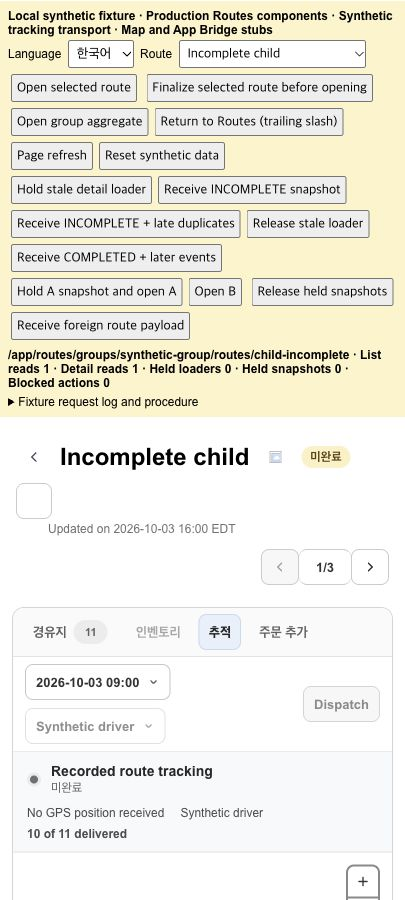

# KFood Routes 상태 표시 검증 — 2026-10-07

대상은 기존 [PR #293](https://github.com/EVNSolution/shopify-clever/pull/293)이다.
연결된 추적 항목은 [대상 issue #292](https://github.com/EVNSolution/shopify-clever/issues/292)와
[change-control #298](https://github.com/EVNSolution/clever-change-control/issues/298)이다.

## 기준과 충돌 해결

- 기존 head: `a26d6fa6d280cee6a6579ea86486ce14b6d312e0`.
- 통합한 main: `e85c5bc1643a8ab8428ac77a69c7194d2ac6d357`.
- 기존 branch와 작업 공간을 재사용했다. 중복 PR을 만들지 않았다.
- 충돌 파일은 `app/routes/app.routes.$routeId.jsx`였다.
- main의 Tracking legend·날짜 overlay 제거, 최신 경로 표와 action 메뉴를 보존했다.
- 종료 상태 guard를 최신 child/standalone timeline 버튼과 편집·제출 경로에 적용했다.
- main의 Orders 검색·선택·pagination과 token authority 변경을 보존했다.
- control-plane preflight의 `ready=true`를 확인했다.
- 다른 저장소는 계획과 상태 계약 확인에만 사용했다. control-plane 문서는 수정하지 않았다.

## 상태 계약과 보완

관리자 표시 상태는 서버가 반환하는 `routePlan.status`, child의 `displayStatus`,
Tracking `operationalState.routeStatus`를 사용한다.
원시 실행 상태와 배송지 수로 관리자 종료 상태를 새로 추론하지 않는다.

| 입력 | 영어 | 한국어 | 표시 |
| --- | --- | --- | --- |
| READY | Ready | 준비됨 | 기존 Ready 색상 |
| IN_PROGRESS | In progress | 진행 중 | 기존 진행 색상 |
| COMPLETED | Completed | 완료 | 기존 완료 색상 |
| INCOMPLETE | Incomplete | 미완료 | amber |
| CANCELLED | Cancelled | 취소됨 | 기존 취소 색상 |
| 미지원·누락 | Unknown | 확인 필요 | neutral |

`DRAFT`, `PUBLISHED`, `OPTIMIZED`, `ASSIGNED`, `UNSTARTED`, `CHANGED`는 기존 Ready 호환 의미를 유지한다.
`UNAVAILABLE`을 포함한 미지원 상태와 누락값을 Ready로 숨기지 않는다.

기존 PR의 INCOMPLETE 보존, 같은 경로 종료 snapshot 유지, 다른 경로 응답 차단,
종료된 child의 membership·순서 변경 제한과 email empty-state 안내를 유지했다.
Email 발송 정책은 변경하지 않았다.

추가 보완 사항:

- 목록·상세 제목·Tracking·필터가 같은 정규화 의미를 사용한다.
- 일반 경로 제목도 최신 상세 상태를 사용한다. loader의 이전 상태를 표시하지 않는다.
- 실제 child의 상태가 누락되면 그룹 집계 상태를 상속하지 않는다.
- 그룹 집계와 개별 child의 상태는 서로 다를 수 있다.
- COMPLETED·INCOMPLETE·CANCELLED는 늦은 loader, snapshot, driver event로 Ready가 되지 않는다.
- 같은 SSE 묶음의 상태·snapshot ref를 즉시 갱신한다. 후속 종료 이벤트가 불필요한 ETA 재조회를 실행하지 않는다.
- 같은 경로의 캐시 목록과 종료 상세가 다르면 Routes 버튼 복귀와 브라우저 Back에서 목록을 갱신한다.
- 이미 일치하는 목록은 재조회하지 않는다. 기존 목록 `shouldRevalidate` 정책은 변경하지 않았다.
- materialized child가 모두 종료·미지원 상태이면 빈 대상이나 오래된 대상 ID로 stop을 추가할 수 없다.
- materialized child가 없는 그룹의 Unassigned 동작은 유지한다.
- INCOMPLETE의 Dispatch·배송지 편집·membership·순서 변경을 제한한다.
- READY sibling은 변경되지 않은 종료 sibling 옆에서 기존 동작을 유지한다.

KFood의 배송 완료 표시와 복귀 내비게이션 유예는 서버 계약을 그대로 따른다.
표시가 COMPLETED이고 원시 실행 상태가 IN_PROGRESS인 유예 사례도 Completed를 유지한다.
미완료 10/11 배송 사례를 Completed로 변경하지 않는다.

## 회귀 검사

생산 정규화·목록·Tracking 함수, 생산 제출 검사와 JSX를 사용했다.
추가 브라우저 fixture는 실제 RoutesPage와 RouteDetail 컴포넌트를 bundle한다.

검사 범위:

- INCOMPLETE + DELIVERED 10건 + ARRIVED 1건 + ROUTE_STARTED + 완료 이벤트 없음.
- READY, IN_PROGRESS, COMPLETED, CANCELLED, legacy, 미지원·누락값.
- 그룹·child·standalone, 집계와 child의 상태 차이.
- 완료 표시와 복귀 내비게이션 유예.
- 상세의 Routes 버튼 복귀, 기본 Back/Forward, 전체 새로고침.
- 열린 상세의 종료 snapshot과 지연 loader.
- 같은 SSE 묶음의 종료·늦은 snapshot·중복 이벤트.
- ROUTE_COMPLETED 이후 STOP_ARRIVED·ROUTE_STARTED 묶음의 ETA 재조회 차단.
- 다른 경로 이동 후 이전 요청 응답과 외부 경로 SSE payload.
- INCOMPLETE의 Dispatch·배송지 편집·순서 변경과 그룹 추가 대상 제한.

로컬 검증:

| 명령 | 결과 |
| --- | --- |
| `npm test` (repo root) | 960/960 통과. 최종 SHA의 CI는 PR에서 확인한다. |
| `node --test tests/kfood-shared-server-regressions.test.mjs` (app) | 26/26 통과 |
| `npm run build` (repo root) | 통과 |
| `npm run typecheck` (repo root) | 통과 |
| 변경 파일 `npx eslint ...` (app) | 통과 |
| `npm run check:public-urls` | 통과 |
| `npm run prisma:migrate:check` (app) | 임시 SQLite replay·schema parity 통과 |
| `npm run verify:token-authority-sdk-source` (app) | 통과 |
| main·dev·kfood compose `config --quiet` | 세 파일 모두 통과 |
| `git diff --check` | 통과 |

전체 `npm run lint`에는 main의 기존 `app.drivers-vehicles.jsx:651` `process/no-undef` 1건이 남는다.
해당 파일은 main과 동일하다.
기존 compliance webhook 테스트의 150ms 제한은 빌드와 동시 실행 시 간헐적으로 실패했다.
단독 검사, 순차 전체 검사, 이후 root `npm test` 재검사에서는 통과했다.
이번 변경에서 webhook 구현과 테스트 시간 제한은 변경하지 않았다.

## 실제 브라우저의 합성 화면 검증

실행:

```bash
node apps/shopify-app/scripts/route-status-browser-fixture.mjs --port 43821
```

`http://127.0.0.1:43821/app/routes`에서 Codex in-app browser로 검사했다.
React Router loader·SSE·언어·페이지 새로고침을 사용하는 실제 생산 컴포넌트 화면이다.
App Bridge, 지도, 인증, Delivery transport는 합성 fixture이다.
Fixture는 생산 API를 호출하지 않는다. 변경 action도 차단한다.
운영 UUID와 개인정보는 포함하지 않는다.

확인 결과:

- 영어·한국어 목록, 제목, Tracking 표시와 INCOMPLETE·UNKNOWN 필터가 일치했다.
- 부분 배송 사례의 Driver stage는 미완료였다. 배송 수는 10/11이었다.
- 시작 이벤트는 표시했다. 완료 이벤트는 확인 불가로 유지했다.
- 미완료 Dispatch·편집·drag guard가 동작했다.
- mixed group에서 미완료·누락 상태 child를 추가 대상으로 선택할 수 없었다.
- 종료 child만 있는 그룹의 Custom Stop 제출 버튼이 비활성화됐다.
- 지연 READY loader와 늦은·중복 SSE 이후에도 Incomplete를 유지했다.
- 종료 이벤트 묶음이 추가 목록·상세 조회를 만들지 않았다.
- 캐시 목록과 종료 상세가 다르면 Back에서 목록 조회가 1회 증가했다.
- 이후 Forward/Back에서는 일치하는 캐시 목록을 다시 조회하지 않았다.
- 전체 새로고침 후에도 Incomplete를 유지했다.
- A의 지연 응답과 외부 A payload는 현재 B의 Ready를 바꾸지 않았다.
- 표시 COMPLETED·원시 IN_PROGRESS 유예 사례는 Completed를 유지했다.
- 실제 변경 action 실행은 0건이었다. 최종 화면의 browser error 로그는 비어 있었다.



## 검증 경계

이 기록은 합성 브라우저 검증이다. 배포되지 않은 운영 화면을 수정 완료 증거로 사용하지 않았다.
패치가 적용된 인증 KFood 화면, 실제 지도·GPS·기사 transport는 확인하지 않았다.
운영 원인 조사는 반복하지 않았다.
PR 병합, 배포, 운영 DB·Shopify 원본 변경, Dispatch, 실제 알림 발송은 실행하지 않았다.
