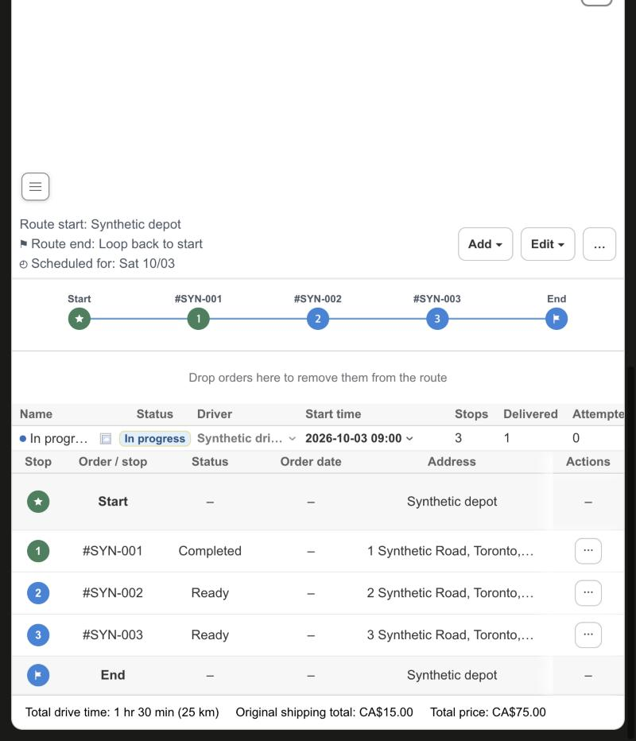
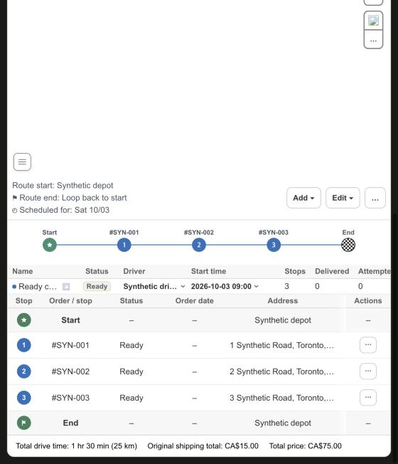

# KFood Route Detail: status-colored circles and one timeline for every route

Date: 2026-10-09. Scope: Route Detail in `apps/shopify-app`. No server, driver app, Shopify data or production data change.

## What was wrong

A route that is the only route of its group (an ordinary route, such as a single-route day) used an older timeline: 18 px circles, a house icon for Start, no End marker, no order labels, and one blue color whatever the status. Routes inside a group of several routes used the newer timeline with order labels, a star Start and a checkered End in the route color. The stop table circles were 20 px with an 11 px number, and its Start and End rows showed a plain star and a diamond.

## Change

- Every route detail uses the newer timeline; the group overview keeps its own lanes. All circles are 24 px with a 12 px number, and the timeline grid and connector follow the larger size.
- An ordinary route colors its circles by status: Ready blue, Completed green, Failed red. Start is green once the route has left the depot (In progress, Completed, Incomplete) and blue before. End is green when the route is completed and blue otherwise, drawn as a flag in a colored circle. The Stop column of the stop table follows the same colors.
- A route inside a group of several routes keeps its own route color and the checkered End; only the size changes.
- The Start and End rows of the stop tables use the same star and flag as the timeline.
- The "Drop orders here to remove them from the route" area stays under the timeline of an ordinary route, and rows that are preview only still cannot be dragged.
- The map markers and the Tracking table colors are unchanged.

## Verification

Unit tests cover the stop tone (done, failed, pending), the Start and End tone for each route status, the row tone, the gating of the two timelines, the 24 px sizes and the endpoint markers. The real Route Detail page ran against synthetic transport (`scripts/route-status-browser-fixture.mjs`): a Ready route is all blue, an In progress route has a green Start and a green completed stop with blue remaining stops and a blue End, a Completed route is all green, a group route keeps its route color and checkered End, and the group overview is unchanged.

