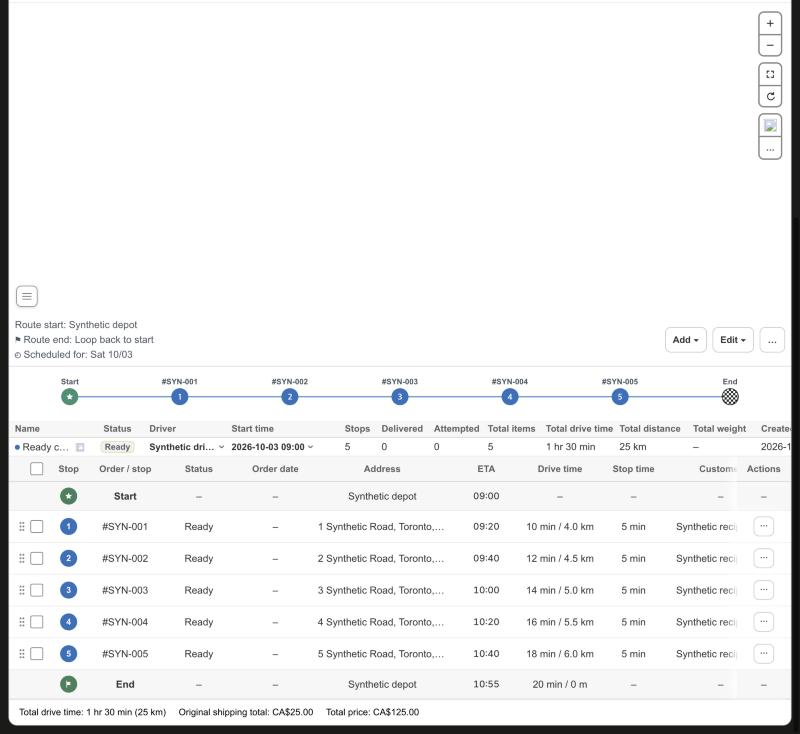
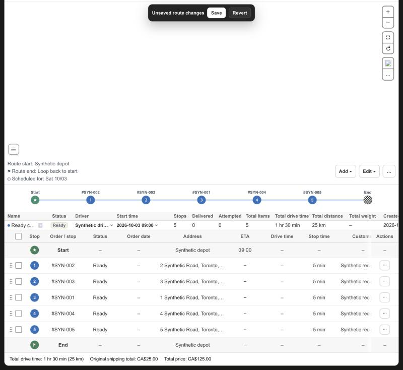

# KFood Route Detail: reorder stops by dragging a handle in the stop table

Date: 2026-10-10. Scope: Route Detail in `apps/shopify-app`. No server, driver app, Shopify data or production data change.

## Change

- Each stop row of the Stops table of a single route starts with a grip handle to the left of its checkbox. The first column grows from 44 px to 56 px, the header keeps a blank space of the handle's size, and the selection bar pads its checkbox to the same place (all three checkboxes sit at the same x). The Start and End rows have no handle. The All routes overview and the Tracking table have none.
- The handle is draggable only on a stop that the timeline already lets staff drag (`canDragTimelineStop`: Ready and in-progress routes, and only future stops in live change mode). The other rows keep an empty space of the same size.
- Dragging a handle moves that one stop inside its route. It starts the same drag as a timeline circle, so the guards, the live change rule (`liveOrderKeepsFixedStops`), the draft, the in-progress confirmation and the saved payload are the ones that exist. The rows and the timeline circles follow the pointer. A pointer in the upper half of a row puts the stop before that row, in the lower half after it, so a stop does not flicker between two rows. A small tag with the stop number and order follows the pointer instead of a snapshot of the 1600 px row, and the dragged row is dimmed.
- Releasing keeps the new order as an unsaved draft: the existing Save and Revert bar saves or discards it. Releasing outside the table, or pressing Escape, puts the stop back. Dragging a stop back to its old place removes the draft.
- The drag says where it started. A drag from the timeline never changes the table, and the table takes a drop only from its own handles (it cancels `dragenter` and `dragover` for them, which a browser needs to accept a drop).
- The Stops table now lists the stops of a single route in the order of an unsaved draft, which their saved sequence used to hide. The Tracking table keeps the saved order. ETA and Drive time of the stops from the first moved one on, and the End row's planned time and drive time, stay empty until the order is saved, because they describe the saved order. A draft that only removed stops keeps every estimate, as before.

## Verification

Unit tests cover the drop rule (halves, first and last place, the stop itself, a row outside the order, no flicker), the handle (draggable grip or empty space, markup), the table rows of an unsaved order (order, numbering, the stale estimates and the stale End row, an unchanged or shortened order), the handlers (only a drag that started from a handle moves rows, a timeline drag does not, the move uses the timeline guards) and the page wiring and alignment (frame handlers, header space, no handle on Start, End or Tracking, column width and bar padding).

The real Route Detail page ran against synthetic transport (`scripts/route-status-browser-fixture.mjs`; the Ready child route now has ETAs so the stale case shows):

- The Stops table shows a handle before each checkbox, a blank space in the header, and none on the Start and End rows. The three checkboxes (header, rows, bar) sit at the same x.
- Dragging #SYN-001 over the upper half of the third row gave `2 1 3 4 5`, over its lower half `2 3 1 4 5`; every row was renumbered and every ETA and Drive time, and the End row's planned time and drive time, showed `–`. Dropping kept that order, showed "Unsaved route changes" and sent no request. Revert brought the saved order and the estimates back.
- Swapping the last two stops left the first three ETAs in place and emptied the last two. Dragging the stop back to its old place gave the saved table with its ETAs again. Ending a drag without a drop, and leaving the table, put the stop back.
- A drag that started on a timeline circle did not change the table.
- With a real mouse drag (the browser pane's own drag) `dragstart` fired from the handle, `dragenter` and `dragover` over the table cells were cancelled, the rows reordered and the drop was accepted, so the new order stayed as a draft.
- A live change route (a synthetic in-progress route with a current stop): the completed and the current stop have no handle, the six future stops do. A future stop could not be dropped above the current stop and could be moved among the future stops.

Not covered locally: saving the reordered route. That is the existing flow of the timeline reorder, unchanged here, and it ran in the delivery API (which recalculates the estimates of a Ready route) that this fixture does not call. A touch screen has no HTML drag and drop, as with the timeline. Reordering by keyboard is not part of this change.
