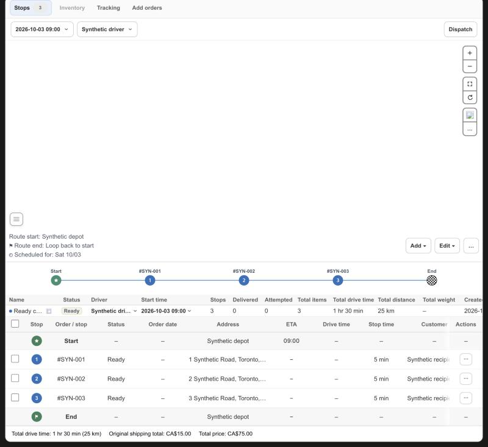
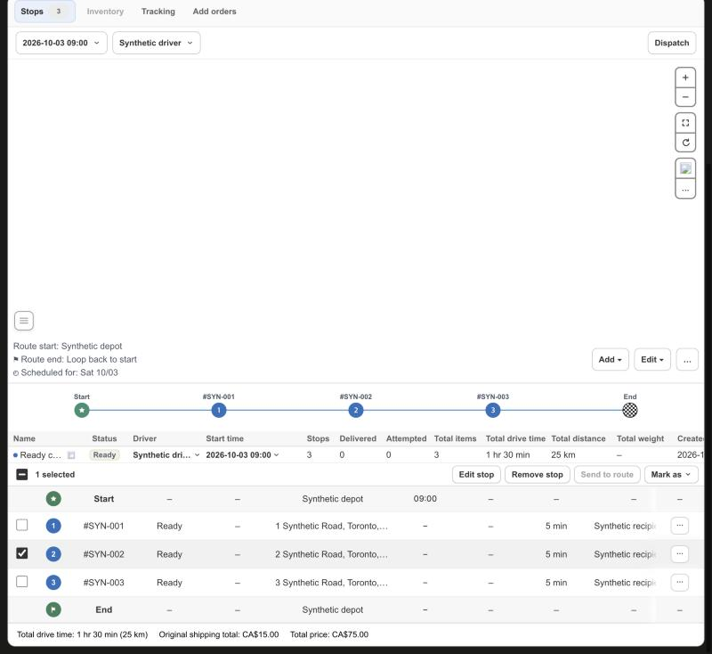
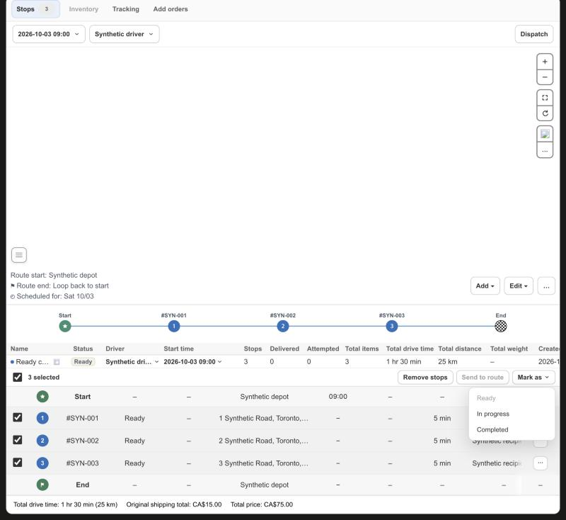

# KFood Route Detail: select stops and act on them from a bar

Date: 2026-10-10. Scope: Route Detail in `apps/shopify-app`. No server, driver app, Shopify data or production data change.

## Change

- The Stops table of a single route has a first column of checkboxes (44 px). The header one selects every stop. The Start and End rows leave the cell empty. The All routes overview, the Unassigned list and the Tracking table have no such column.
- Selecting a stop turns its row grey and replaces the header row with a bar of the same height (36 px). The bar has a leading checkbox that clears the selection (a dash while only some stops are selected), `N selected`, and the actions:
  - `Edit stop`, for one selected stop only. It opens the same dialog as the row menu.
  - `Remove stop` or `Remove stops`. It removes the selected stops from the unsaved route draft, like the row menu does for one stop. It is disabled once the route has started.
  - `Send to route`. One possible target sends at once. Several open a list. It is disabled when no other route can take the stops.
  - `Mark as` with Ready, In progress and Completed. A status that every selected stop already has is disabled.
- A disabled button says why in its tooltip. The rules are the ones of the row menu (`canEditStopRow`, `canRemoveChildStopFromGroup`, `isRouteTimelineStopMoveAllowed`), applied to every selected stop.
- `Mark as` sends one new action, `transitionRouteStops`, with the stops and one idempotency key each. The app server applies them one after the other through the same delivery API call as the single status change, stops at the first failure, and answers how many changed. The page reloads its data after a partial success too, and shows `Marked 1 of 3 stops. Stopped at <order>: <reason>`. A request with no stops, more than 200, a repeated stop or a status other than Ready, In progress or Completed never reaches the delivery API.
- The bar sits outside the horizontally scrolling table, so it stays in view while the table scrolls and its menus are not clipped. Escape or a press outside closes a menu. The selection is cleared when the route changes.
- Each Select checkbox and each Stop time pencil is named after its order (`Select #2330`, `Edit stop time for #2330`). The Stop time editor hands keyboard focus back to its pencil when it closes.
- Cancel and Pickup are not part of this change.

## Verification

Unit tests cover the selection helper (table order, stale keys, all or some), the checkboxes and the dash, the bar (Edit only for one stop, wording of Remove, disabled buttons with their reasons, one or several Send targets, the Mark as list, the leading checkbox, Escape), the server action (several stops in order, stop at the first failure, every kind of bad batch), the Stop time cell labels and the page wiring (Select column for a single route only, header hidden while selecting, bar and header the same height, bulk rules reusing the row menu rules).

The real Route Detail page ran against synthetic transport (`scripts/route-status-browser-fixture.mjs`; the fixture now also accepts this one bulk action on its synthetic stops):

- A Ready child route shows the header checkbox and one checkbox per stop. The header row is 36 px and the bar is 36 px, so its bottom edge meets the first row exactly.
- One stop selected: `1 selected`, Edit stop, Remove stop, Send to route (disabled with its tooltip), Mark as. Its row is grey. Three selected: `3 selected`, Remove stops, Send to route, Mark as, and the leading checkbox shows a tick. Two of three: the leading checkbox shows a dash.
- Mark as lists Ready (disabled while every stop is Ready), In progress and Completed below the bar. Escape and a press outside both close it and keep the selection.
- Mark as Completed on three stops sent exactly `COMPLETED` for `#SYN-001`, `#SYN-002` and `#SYN-003`, showed the toast "3 stops updated", changed the three rows to Completed and removed the bar.
- Remove stops on two selected stops removed those two rows from the table, closed the bar and showed "Unsaved route changes" with no request sent. Edit stop on one selected stop opened the Edit stop dialog.
- Send to route is disabled in every state of the committed fixture, exactly like the row menu, because a draft route made with Add Empty Route has no status and a route without a known status cannot receive stops. A throwaway copy of the fixture (not committed) that gave the draft route the Ready status enabled the button with one target. Sending moved the selected stop to that route, closed the bar and showed "Unsaved route changes" with no request. The list for several targets is covered by unit tests only, because the page could not produce a third route.
- An In progress route shows Remove and Send disabled with their reasons and Mark as and Edit stop enabled. The group overview and the Tracking table have no checkboxes. Escape and Cancel of the Stop time editor, and a save, put focus back on the pencil of that stop.

Not covered locally: the real delivery API rules for a status change (for example which stop statuses may follow each other). The bulk action calls the same API function as the single change and reports the first rejection, so a rejected stop shows the API's own message. Not covered live: no K-food route was changed during this check.
