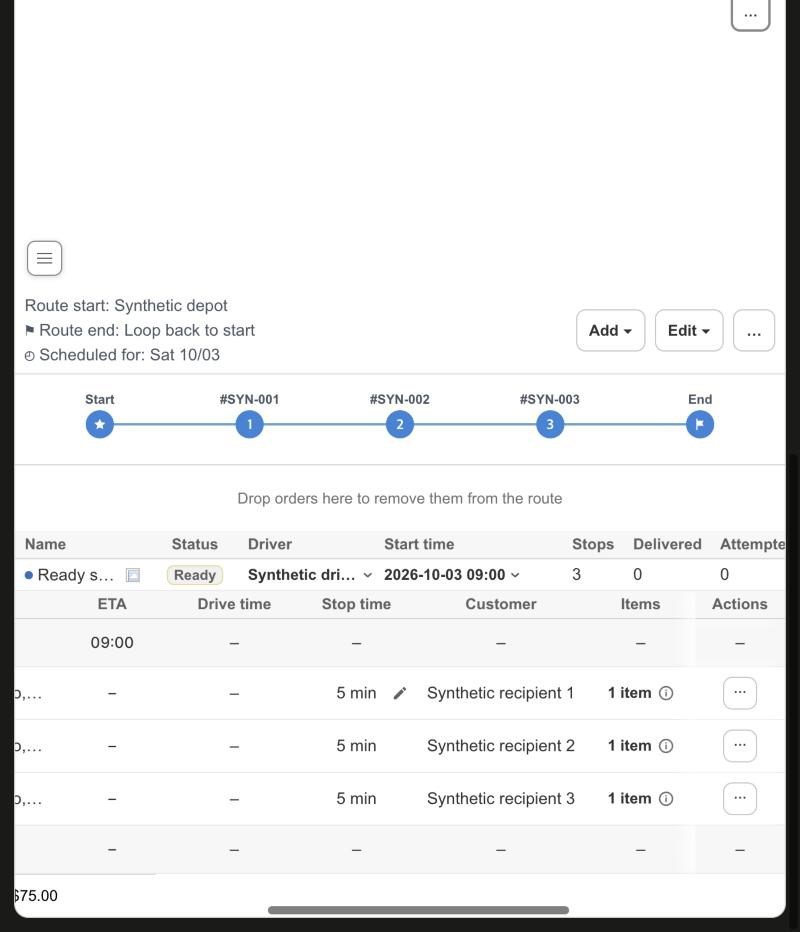
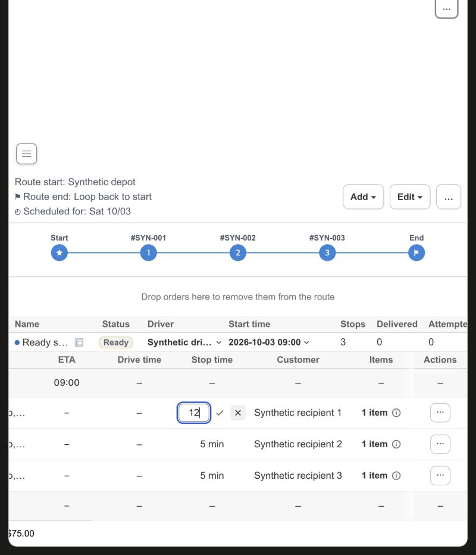

# KFood Route Detail: edit one stop's Stop time with a hover pencil

Date: 2026-10-10. Scope: Route Detail in `apps/shopify-app`. No server, driver app, Shopify data or production data change.

## Change

- The Stop time cell of the Stops table keeps a margin at its right edge. A pencil shows there only while the pointer is over the cell, while the pencil has keyboard focus, or always on a screen without hover. The column grows from 82 px to 104 px to make the margin.
- The pencil opens an inline editor for whole minutes from 0 to 1440. Enter or the check saves, Escape or the cross cancels. A value that is not a whole number in that range cannot be saved: the field turns red and the check is disabled.
- The editor closes only after the server accepted the value. A failed save keeps the editor open with the typed value and shows the error. While a save runs, the field is read-only and the check is disabled.
- The pencil exists only on a Ready single route (including the legacy pre-execution statuses), outside live change mode, for a stop that is already saved. The server recalculates ETAs after a Stop time change only for a Ready route, so In progress, Completed, Incomplete, Cancelled and unknown routes, the All routes overview and the Tracking table show no pencil.
- The save sends a new narrow action, `updateRouteStopTime`, that writes only `serviceMinutes` through the stop override the Edit stop dialog already uses. The delivery API accepts a partial override and recalculates the ETAs of a Ready route in the same request. The one-day cap (1440) lives in the app because the API has no upper bound.

## Verification

Unit tests cover the minutes check, the cell (pencil only when editable, editor markup, Enter, Escape, the check and cross buttons, invalid and busy states), the server action (only `serviceMinutes` reaches the delivery API, invalid values never do) and the page wiring (Ready single route gate, Stops table only, column width, hover CSS).

The real Route Detail page ran against synthetic transport (`scripts/route-status-browser-fixture.mjs`; the fixture accepts only this one action and still blocks every other):

- A Ready route shows a pencil on the hovered row only. A legacy Draft route and a Ready child route of a group show pencils. In progress, Completed, unknown, Incomplete child, the group overview and the Tracking table show none.
- An invalid value (51441) turns the field red, disables the check, and Enter sends nothing.
- A failed save (the fixture rejecting the action) keeps the editor open with the typed value `12` and shows the error.
- A saved value sent exactly `{ _intent: updateRouteStopTime, deliveryStopId: route-ready-stop-2, serviceMinutes: 12 }`, closed the editor, showed the toast "Stop time updated" and, after the page reloaded its data, showed `12 min` on that stop only.

Not covered locally: the ETA recalculation itself runs in the delivery API (`GEOMETRY_AFFECTING_STOP_OVERRIDE_FIELDS` includes `serviceMinutes`), not in this app. If the routing provider fails during that recalculation the API answers 503 after it stored the value, and the page shows the error.
