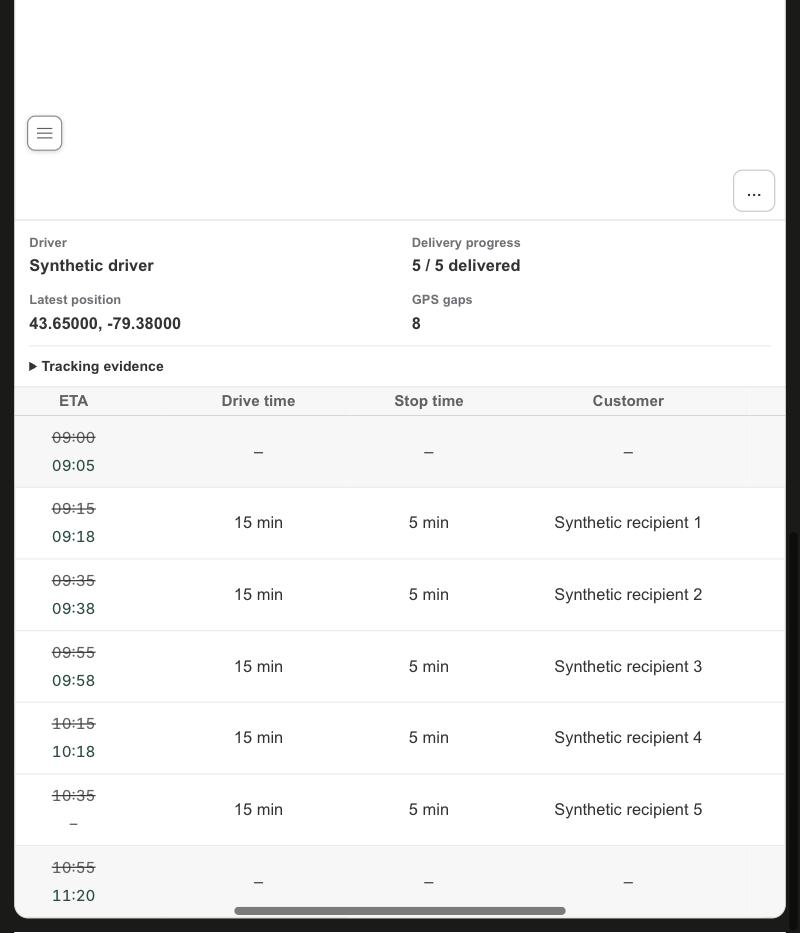
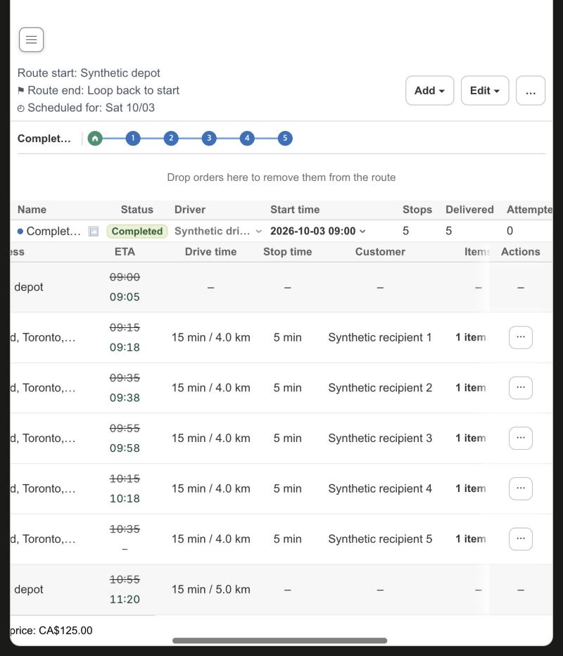

# KFood Tracking: End time, End drive time, missing arrival and last position format

Date: 2026-10-09. Scope: the Tracking tab and the Start/End rows of the stop tables in `apps/shopify-app`. No server, driver app, Shopify data or production data change.

## What the K-food routes showed (view only)

- The route total already included the way back: on the 11-stop route, Total drive time 1 hr 45 min (64 km) equals the stop legs (88 min, 51.6 km) plus 17 min and 12.4 km to the End. The End row printed `–` in the Drive time column, so the column did not add up to the total.

- Two completed routes (11 and 8 stops) both reported **Completed event: Unavailable** and **Return to depot: Unavailable**. The server answers `UNAVAILABLE` whenever a route has no `ROUTE_COMPLETED` event, whatever the last position is, and K-food routes finish without that event. The End row therefore showed only the original plan time (for example 11:39 and 12:09), which was earlier than the last stop's actual arrival, and never an observed time.
- On the 11-stop route the last stop had no `STOP_ARRIVED` event. Its last rolling estimate (12:23) was shown in the same green as observed times, so it looked recorded.
- **Last position** and the evidence timestamps used the browser locale (for example Korean text with `GMT-4`) while the rest of the screen used English labels and 24-hour store time.

## Change

- The End row shows `Return observed (GPS)` when the server reports no confirmed return: the first recorded GPS point within the server's depot radius (150 m) after the last known arrival. It applies only when every stop is finished, a stop arrival is known, the depot has saved coordinates and the last stop is outside the radius. A server-confirmed return always wins. The Tracking evidence panel shows `Observed (GPS)` (GPS 관측) with time and distance in its tooltip.
- A visited stop (delivered or failed) with an estimate but no recorded arrival keeps the estimate struck through, shows an empty actual and says `No arrival event was recorded` in its tooltip. Skipped and cancelled stops are never flagged.
- Tracking timestamps use `YYYY-MM-DD HH:mm:ss zone`, the same store-time helper as the rest of the page.
- The End row prints the leg back to the depot in the Drive time column (route total minus the stop legs, for example `17 min / 12 km`) on the Stops and Tracking tabs. It stays empty when the total or a stop leg is missing, when the total has no return leg, or when the route ends at the last stop.

## Limits

- The API gives no arrival time for a stop without a `STOP_ARRIVED` event, and the app does not infer one from GPS because neighbouring stops make that unreliable. The empty actual is shown honestly. Stamping it needs the driver app or server to record or expose the time.
- The server still reports the return as unavailable. The GPS time is the first point seen at the depot, not a driver completion.

## Verification

Unit tests cover the GPS finder, the End presentation (observed, server-confirmed, and every case that must not guess), the missing-arrival flag and the fixed time format. The real Route Detail page ran against synthetic transport (`scripts/route-status-browser-fixture.mjs`, route "Completed, no completion event, GPS return"): stops 1 to 4 show the struck estimate over the actual, stop 5 shows its struck estimate over an empty actual, End shows the struck plan time 10:55 over the observed 11:20, and the evidence panel reads `Observed (GPS)` with "14 m from depot (threshold 150 m)".

The Stops tab of the same synthetic route: five stop legs of 15 min / 4.0 km and an End leg of 15 min / 5.0 km add up to the footer, Total drive time 1 hr 30 min (25 km).

