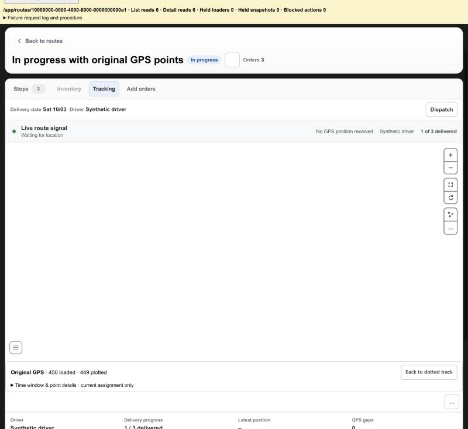
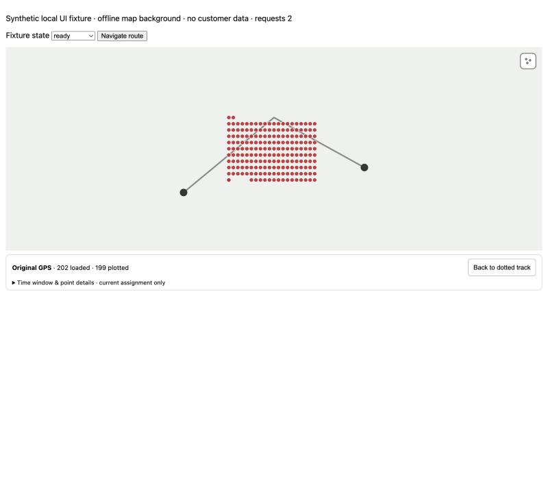

# KFood Tracking: switch the map between the dotted route and the original GPS points

Date: 2026-10-10. Scope: Route Detail Tracking tab in `apps/shopify-app`. No server, driver app, Shopify data or production data change. Nothing is stored or exported.

## Change

- The map toolbar of the Tracking tab has a points icon (`aria-pressed`, `gpsPoints=raw` in the URL). It switches the same map from the dotted tracking line to one circle per original GPS point the driver app sent, with nothing left out and nothing joined into a line. Turning it off, or `Back to dotted track`, brings the dotted tracking back. The Stops tab map has no such icon.
- A strip under the map says `Original GPS · N loaded · M plotted`. Every point is counted; only a point with a valid coordinate pair is drawn. A collapsed section shows the exact window and, for the selected point, its coordinates, accuracy, observed time and stored time.
- The work is the closed PR #300 (head `6962760`, kept in change-control #300) ported onto current main: the same modules, tests, preview fixture and contract document, one merge conflict (the route-file list of `navigation-contract.test.mjs`). The server read is `GET /admin/route-plans/:id/tracking/original-observations` (clever-route-server PR #463). Its contract is unchanged between the draft #300 was written against and the deployed server.
- New in this port: the pages of 200 points now follow one another automatically up to the 5,000-point cap (at most 25 reads for one toggle), so the map shows every point without a click. While pages are on their way the strip says `N loaded · loading more…`. Cancel stops the loading and Load more resumes it. #300 had an explicit Load more for every page.
- Unchanged from #300: the app resource `/app/route-original-observations/:routePlanId` proxies the server read with the administrator session (query and cursor checked, no cache, no log); empty, unavailable (404, 501), timeout, changed-assignment and expired-cursor states are told apart and never fall back to the processed trail.

## Verification

Unit tests: the 28 tests of #300 (contract validation, paging, cancel and stale responses, map layers, proxy, URL toggle, time window) pass on current main, and 4 new tests pin the automatic loading, Cancel, Load more, the strip text and the toggle wiring.

The synthetic preview of #300 (`node_modules/.bin/vite --config scripts/gps-preview.config.mjs`, real MapLibre layers on an offline background):

- 202 points loaded in two reads without a click, `202 loaded · 199 plotted` (three points have a missing, invalid or redacted coordinate pair), the dotted trail hidden.
- The cap case loaded 25 pages without a click and stopped at `5000 loaded · 4997 plotted` with "5,000-point cap reached".
- Cancel while loading stopped the loading and stayed stopped; Load more resumed it up to the cap.

The real Route Detail page against synthetic transport (`scripts/route-status-browser-fixture.mjs`; the route with a UUID id now serves 450 synthetic points, 200 per page; its map is a stub):

- The points icon is absent on the Stops tab and present on the Tracking tab. Turning it on set `gpsPoints=raw`, made three reads (first, 200, 400) and showed `450 loaded · 449 plotted`.
- Browser Back removed the parameter and the strip, Forward restored them, and `Back to dotted track` removed them again.

Not covered locally: the real page draws on a stubbed map in the fixture, so the circle layer was seen only in the preview. Authenticated KFood data is checked after the manual deployment, view only.

## Follow-up: points not drawn on the real map

The authenticated KFood check after the first deployment showed the strip counting `1838 loaded · 1838 plotted` while the map showed no circles. The points were gated on `map.isStyleLoaded()`, which is false while any tile is loading; the page's own layers only need the map to have a style (`isRouteDetailMapStyleReady`). The first sync, at an idle moment, created the source and hid the dotted trail, and the later pages were skipped, so the source stayed empty.

Reproduced on the preview with `?slowTiles=1` (a raster source whose tiles never arrive, `isStyleLoaded()` false): with the old code the strip said `202 loaded · 199 plotted` and the map had no circles; with the points code using the page's readiness check all 199 circles are drawn while `isStyleLoaded()` stays false. Two unit tests cover drawing and removing with `isStyleLoaded()` false and a map without a style.
